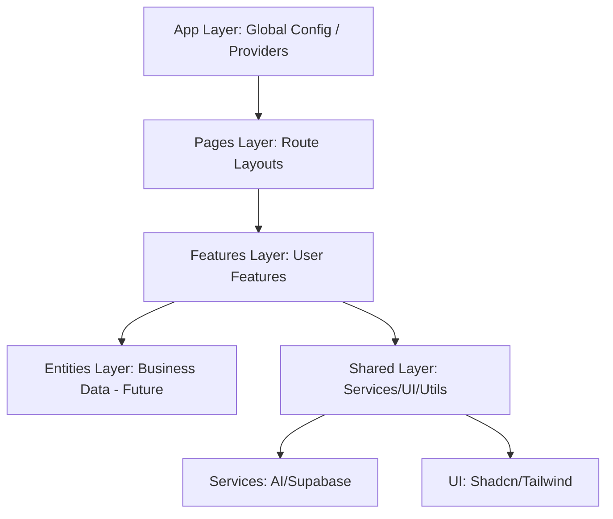
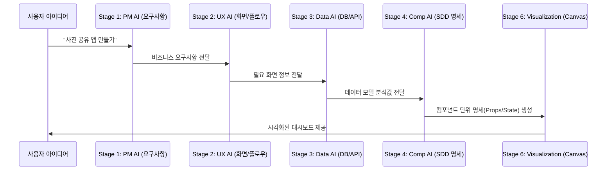

# 🚀 NoVague AI (Vibe Coding Manager) - Deep Specification

이 문서는 NoVague AI 프로젝트의 기술적 설계, 아키텍처 철학, 그리고 AI 기반 소프트웨어 설계 도구로서의 동작 원리를 심층적으로 정의합니다.

---

## 🏗️ 1. 아키텍처 철학: Feature-Sliced Design (FSD)
NoVague AI는 코드의 예측 가능성과 유지보수성을 위해 FSD 아키텍처를 엄격히 준수합니다.

### 층위별 상세 정의 (Layers & Slices)

1.  **`app/` (Global Settings)**: Next.js App Router의 진입점입니다. `ThemeProvider`, `Zustand` 하이드레이션, 전역 CSS 및 폰트 설정을 포함하며 시스템의 "껍데기" 역할을 합니다.
2.  **`pages/` (Composition)**: `MainPage.tsx`가 위치하며, 여러 `Features`를 조합하여 하나의 화면으로 조립합니다. 비즈니스 로직은 없으며 레이아웃 구성에만 집중합니다.
3.  **`features/` (Capabilities)**: 독립적인 기능을 수행하는 단위입니다.
    -   `diagram-editor`: React Flow를 이용한 시각적 설계 기능.
    -   `prompt-engine`: 설계 데이터를 AI 프롬프트로 변환하는 기능.
    -   `auth`: Supabase 기반 사용자 인증 및 접근 제어.
4.  **`services/` (External Systems)**: 외부 인프라와의 통신을 캡슐화합니다.
    -   `supabase.ts`: 실시간 DB 동기화 및 영속성 관리.
    -   `ai/`: PM, UX, Data, Component 각 단계의 AI 아키텍트 로직.
5.  **`shared/` (Foundation)**: 프로젝트 전체에서 재사용되는 UI 컴포넌트(`components/ui/`), 유틸리티(`common-utils.ts`), 상수 정의 등을 포함합니다.

---

## 🧠 2. AI 아키텍트 파이프라인 (The 10-Stage Pipeline)
NoVague AI는 사용자의 단순한 아이디어를 구체적인 설계 문서(SDD)로 진화시키기 위해 단계별 AI 에이전트를 운영합니다.

### 아키텍처 데이터 진화 과정

| 단계 (Stage) | AI 역할 | 기술적 산출물 (JSON Object) |
| :--- | :--- | :--- |
| **Stage 1: PM** | 프로젝트 성격 분석 및 모호성 제거 | `techStack`, `coreFeatures`, `userRoles` |
| **Stage 2: UX** | 사용자 여정(User Journey) 및 화면 관계 정의 | `screenFlow`, `routeMap` |
| **Stage 3: Data** | 영속성 데이터 모델링 및 인터페이스 설계 | `erdSchema`, `apiSpec(REST/RPC)` |
| **Stage 4: Component** | 컴포넌트 원자 단위 분해 및 SDD 작성 | `propDefinitions`, `stateDefinitions` |
| **Stage 5: Validator** | 설계 간 무결성 및 논리적 오류 검증 | `validationReport` |
| **Stage 6: Engine** | 설계 데이터를 Node/Edge 그래프로 자동 배치 | `ReactFlow Nodes/Edges` |

---

## 📋 3. SDD (Software Design Document) 사양
시스템의 핵심 성공 요인은 AI에게 얼마나 정밀한 맥락을 제공하느냐에 있습니다.

### SDD 데이터 구조 (`types/index.ts`)
1.  **Interfaces**: React 컴포넌트의 타입 안정성을 위한 정의.
    -   `Props`: 이름, 타입, 필수 여부, 기본값.
    -   `State`: 내부 상태의 초기값 및 상태 변화 로직.
    -   `Events`: 자식 노드로 전달하거나 부모로 버블링되는 이벤트 명세.
2.  **Logic Spec**: 데이터와 로직의 연결.
    -   `Endpoints`: 해당 노드가 사용하는 API URL 및 Method.
    -   `TableSchema`: 노드와 직접 연관된 DB 테이블 필드 구조.
3.  **Context Bundling (Prompt Engine)**:
    -   프롬프트 생성 시 해당 노드뿐만 아니라 **'연결된 노드(Dependencies)'**의 정보를 재귀적으로 탐색하여 AI에게 "이 컴포넌트는 저 API를 사용한다"는 논리적 연결 고리를 제공합니다.

---

## 💾 4. 데이터 영속성 및 동기화 전략
Zustand와 Supabase를 결합하여 오프라인 우선 설계와 실시간 협업 기반을 마련했습니다.

-   **State Sync**: `immer` 미들웨어를 사용하여 불변성을 유지하며 상태를 업데이트합니다.
-   **Auto-save**: 사용자의 편집이 발생할 때마다 `projectStore`가 감지하여 Supabase RLS 보안 정책이 적용된 DB에 비동기 저장합니다.
-   **History**: `undo/redo` 스택을 관리하여 설계 과정의 실수에 대응합니다.

---

## 🛣️ 5. 미래 로드맵 (Future Roadmap)
-   **Stage 7: Interactive Chat**: 캔버스 옆에서 AI와 채팅하며 아키텍처를 실시간 수정.
-   **Stage 8: GitHub Spec Sync**: 설계 문서를 `.github/specs/` 폴더에 마크다운 형식으로 자동 PR.
-   **Stage 9: Usage Analytics**: AI 모델 사용량 추적 및 최적화 리포트 제공.

---

> [!IMPORTANT]
> 이 문서는 프로젝트의 **기술적 헌장**입니다. 모든 새로운 기능 추가와 리팩토링은 위 아키텍처 원칙(FSD)과 SDD 파이프라인의 일관성을 저해하지 않는 범위 내에서 이루어져야 합니다.
